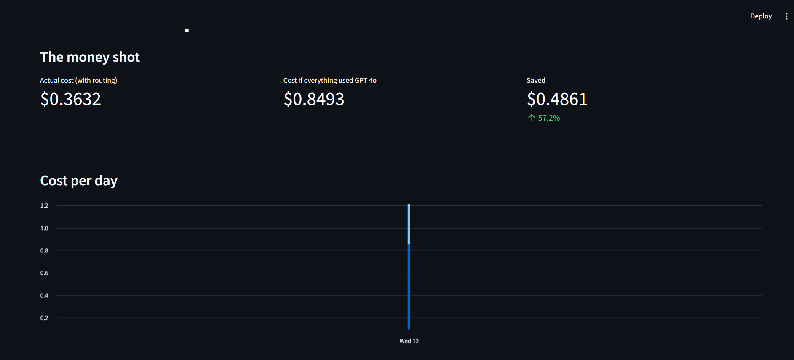
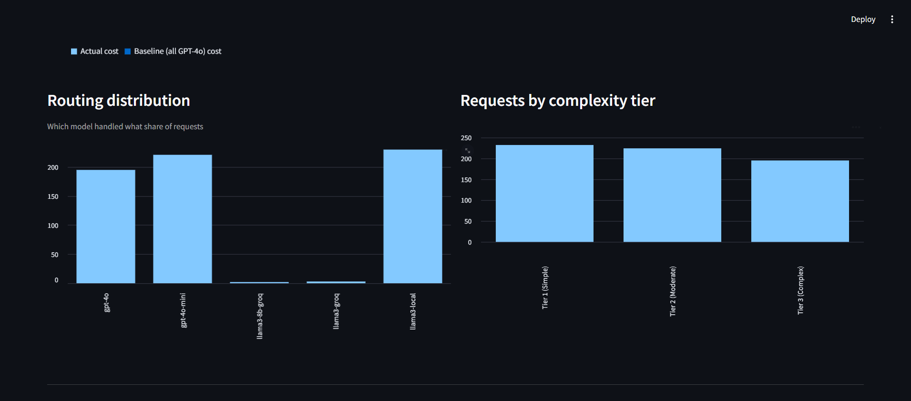
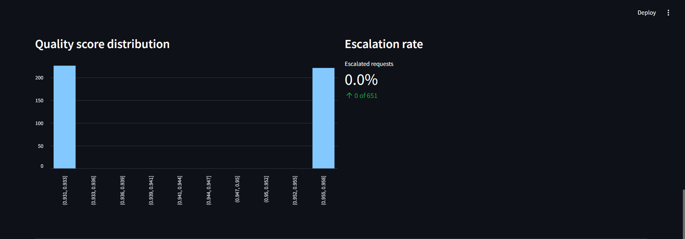
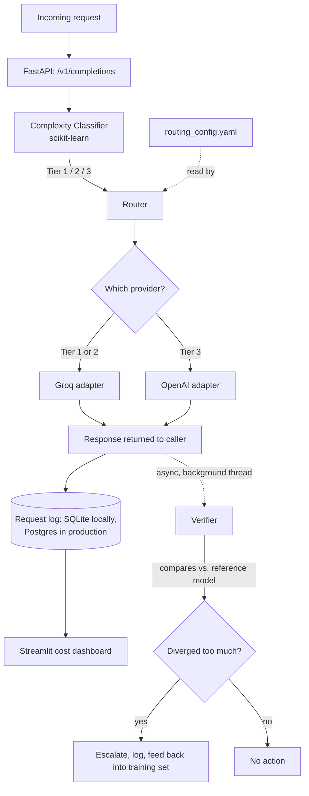

# LLM Cost Autopilot

<p align="center"></p>

<p align="center">
  <a href="https://github.com/19himanshurane/llm-cost-autopilot/actions/workflows/tests.yml"></a>
  
  
  
  
  
</p>

<p align="center">
  <a href="https://llm-cost-autopilot-zgdswdlh66xbgjjj6hdal3.streamlit.app"><b>Live demo</b></a> &middot;
  <a href="https://llm-cost-autopilot-gt30.onrender.com/docs"><b>Live API docs</b></a> &middot;
  <a href="#setup">Setup</a> &middot;
  <a href="#try-it-in-2-minutes">Try it in 2 minutes</a> &middot;
  <a href="CASE_STUDY.md">Case study</a> &middot;
  <a href="#how-it-works">Architecture</a>
</p>

**[Try the live dashboard](https://llm-cost-autopilot-zgdswdlh66xbgjjj6hdal3.streamlit.app)** - no setup, no local run. Open the "Try it live" tab, send a prompt, and watch it get classified and routed to a real model in real time.

---

## The problem

Most teams calling LLM APIs send every request - a one-line data extraction, a two-sentence summary, a genuinely hard multi-step reasoning task - to the same model, usually the most capable (and most expensive) one available. That is the easy default, and it is a straightforward way to overspend by 2-20x on requests that never needed that much capability in the first place.

**LLM Cost Autopilot** is the routing layer that fixes this: it scores every incoming request complexity, sends it to the cheapest model that can actually handle it, and continuously checks its own decisions in the background - auto-escalating and retraining when it gets one wrong.

## What it does

| Stage | What it does |
|---|---|
| Complexity classifier | scikit-learn model scores each prompt into Tier 1 (simple) / 2 (moderate) / 3 (complex) using 9 lightweight text features - 86% accuracy on held-out data |
| Router | maps each tier to a model via `routing_config.yaml`, hot-reloadable through the API - no redeploy needed to change routing |
| Async verifier | re-runs the same prompt through a reference model in a background thread, compares answers, and escalates + logs on disagreement |
| Retraining loop | escalated mismatches feed back into the training set for the next classifier retrain |
| Cost dashboard | Streamlit view of actual vs. baseline cost, routing distribution, and escalation rate - reads live from the API |
| API | FastAPI service - `/v1/completions`, `/v1/models`, `/v1/stats`, `/v1/routing-config` |

## What it looks like





Full results writeup: [`CASE_STUDY.md`](CASE_STUDY.md).

## Setup

```bash
git clone https://github.com/19himanshurane/llm-cost-autopilot.git
cd llm-cost-autopilot
python -m venv .venv && source .venv/bin/activate   # Windows: .venv\Scripts\activate
pip install -r requirements.txt

cp .env.example .env
# Add a free Groq key from console.groq.com to GROQ_API_KEY in .env -
# Tier 1 and Tier 2 will then run on real, free inference immediately.
```

## Try it in 2 minutes

```bash
uvicorn app.api.main:app --reload
# -> http://localhost:8000/docs
```

In a second terminal:

```bash
streamlit run dashboard/app.py
```

Or run both together:

```bash
docker compose up --build
```

## How it works



Every provider adapter falls back to a mock response when no key is configured, which is how this system was built and validated end to end before spending anything. Today, **Tier 1** and **Tier 2** run on real, free inference via **Groq** - verified end to end with real responses, real (near-zero) cost, and real latency. **Tier 3**, routed to GPT-4o, stays mocked, since no free tier exists for OpenAI frontier models.

## Configuration

Per-tier routing lives in `routing_config.yaml` and can be changed live via `PUT /v1/routing-config` - no redeploy required:

```yaml
routing:
  tier_1_simple: llama3-8b-groq
  tier_2_moderate: llama3-groq
  tier_3_complex: gpt-4o
```

Environment variables (see `.env.example`):

| Variable | Purpose |
|---|---|
| `GROQ_API_KEY` | free-tier key from console.groq.com - powers Tier 1 and 2 for real |
| `OPENAI_API_KEY` / `ANTHROPIC_API_KEY` | optional - add either to run Tier 3 for real too |
| `FORCE_MOCK_MODE` | set `true` to force mock mode everywhere regardless of keys (useful for demos/CI) |

## Development

```bash
pytest tests/ -v
```

app/
models.py ModelConfig dataclass + the model registry
response.py Standardized Response object every provider returns
client.py send_request() - the single unified entry point
providers/ One adapter per provider (OpenAI, Anthropic, Groq) + mock fallback
routing/ Complexity tiers, feature extraction, router
eval/ Scorer, verifier, sync + async verification pipelines
db/ Request logging (SQLite locally, Postgres in production)
api/ FastAPI service
dashboard/ Streamlit cost dashboard
scripts/ Dataset generation, training, load testing, reporting
tests/ Unit tests
data/ classifier.joblib ships with the repo; local logs are gitignored


## Known limitations

- Pricing in `app/models.py` is a point-in-time snapshot - verify against current provider pricing pages before quoting savings numbers publicly.
- Quality verification uses one general text-similarity threshold rather than task-type-specific checks (exact match for extraction, LLM-judged scoring for open-ended generation, label match for classification).
- Verification runs as a background thread inside the API process rather than a separate worker with a real task queue - sufficient at this project scale, the first thing to change for meaningfully more traffic.
- Tier 3 (GPT-4o) is mocked in the live deploy, since no paid OpenAI key is configured. Verification compares real cheap-model answers against that mocked reference, so the dashboard's escalation rate reads high by construction - it is not a signal that the cheap models are performing badly.
- The live API runs on Render's free tier, which spins down after ~15 minutes of inactivity. The first request after a quiet period can take up to a minute to wake back up.
- The public API is rate-limited to 10 requests/minute per IP to protect the underlying free-tier Groq quota.

## License

MIT - see [LICENSE](LICENSE).

---

<p align="center">Built to prove that "cheapest model that works" beats "most expensive model, always" - with the receipts to back it up.</p>
